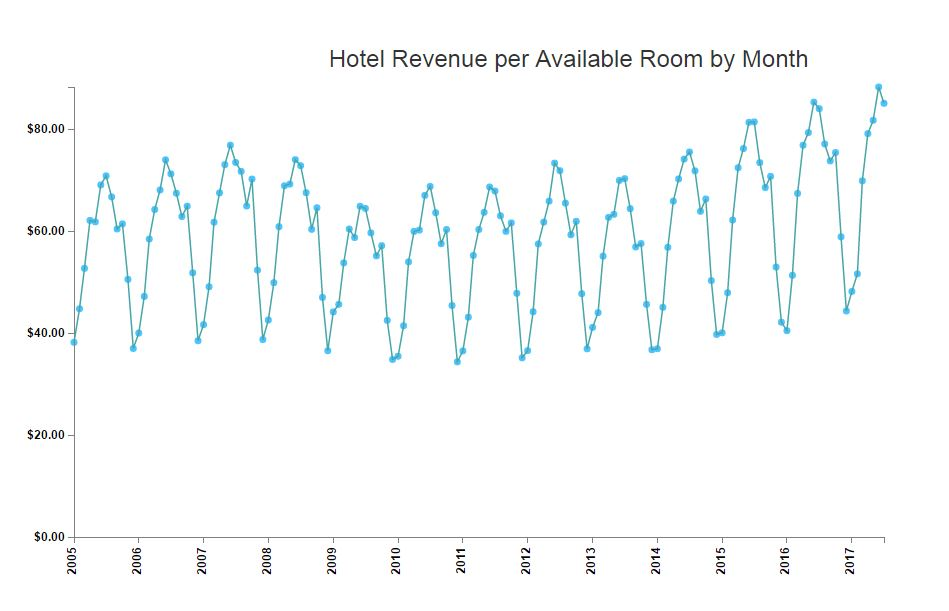
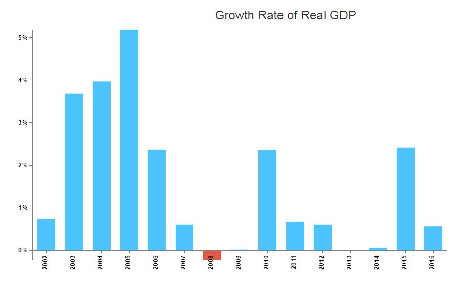

# CEAP-Dashboard

Dashboard for economic forecasting project to analyze hotel revenue, US employment data and port data as a part of Center for Economic Analysis and Policy(CEAP).

[Live Demo](http://qav2.cs.odu.edu/rohila/OduEfp/dashboard.html)

### Data Pre processing
Converted excel files to CSV's in a specific format. Used to maintain EFP website.
**python-xlrd** is used to preprocess data and also create a Powerpoint presentation.
**paramiko**, a python based module, is used to send files from local to a sftp server.

### Visualization
#### 1. Line Chart 

This is used to display trends in hotel revenue, unemployment rate and weekly wages.

#### 2. Bar Chart 

This is used to display trends in growth rate of Real gross domestic product in various regions of virgina state.

### Tech
* Python
* LAMP Stack
* D3.js
